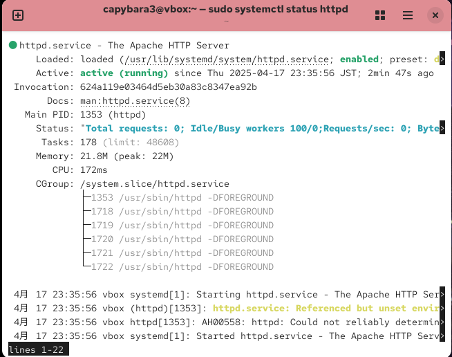

# Capybara3のインフラ練習
CentOSでApache立てて、Hello World表示しました。
- Linux勉強中
- インフラエンジニア目指してます

## Apacheサーバー構築
1. インストール: `sudo dnf install httpd -y`
2. 起動: `sudo systemctl start httpd`
3. ファイアウォール: `sudo firewall-cmd --permanent --add-service=http`
4. HTML作成: `/var/www/html/index.html`にHello World書いた

## Apache構築のスクショ

